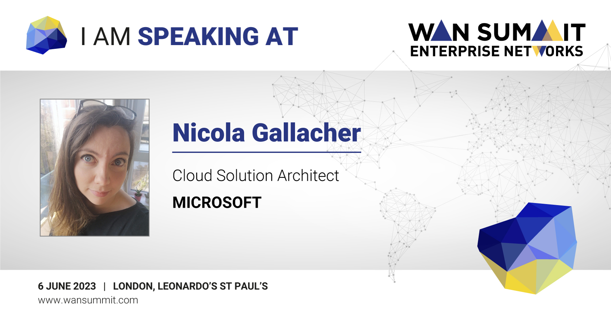

# Event Information

[WAN Summit: Enterprise Networks London 2023 Site](https://events.wansummit.com/event/ea4e90be-015f-4702-b258-20bc42faa330/summary?gclid=CjwKCAjw67ajBhAVEiwA2g_jEFFvlcIgnSojtSZpaGhYkY8WR99X4x_GEXZPNlVnxI5yG4M4eLvFyhoClfgQAvD_BwE)

# Securing Your Enterprise Networks with Azure
## Case Studies 

- [ÖBB TicketShop](https://customers.microsoft.com/en-gb/story/1544373307420093342-obb-travel-and-transportation-azure)

- [AT&T](https://customers.microsoft.com/en-gb/story/1390001334895632063-att-telecommunications-private-link)

## Azure Features Discussed 

- [DDoS Protection](https://learn.microsoft.com/en-us/azure/ddos-protection/ddos-protection-overview)
- [Web Application Firewall](https://azure.microsoft.com/en-gb/products/web-application-firewall)
- [Azure Firewall](https://learn.microsoft.com/en-us/azure/firewall/overview)
- [vNet Integration](https://learn.microsoft.com/en-us/azure/app-service/overview-vnet-integration)
## Useful Resources

- [Zero Trust Security](https://learn.microsoft.com/en-us/azure/security/fundamentals/zero-trust)
- 
- [Zero Trust Networking with Azure vWAN](https://learn.microsoft.com/en-us/security/zero-trust/azure-virtual-wan)
   
- [Azure Network Security Blog](https://techcommunity.microsoft.com/t5/azure-network-security-blog/bg-p/AzureNetworkSecurityBlog)

- [Virtual Networks with Azure Open AI and Cognitive Services](https://learn.microsoft.com/en-gb/azure/cognitive-services/cognitive-services-virtual-networks?context=%2Fazure%2Fcognitive-services%2Fopenai%2Fcontext%2Fcontext&tabs=portal)

## References 
- [Cost of a Data Breach 2022](https://www.ibm.com/reports/data-breach)

# Thank You!
I hope you enjoyed the session, please feel free to connect with me on LinkedIn [here](https://www.linkedin.com/in/nicolagallacher/)